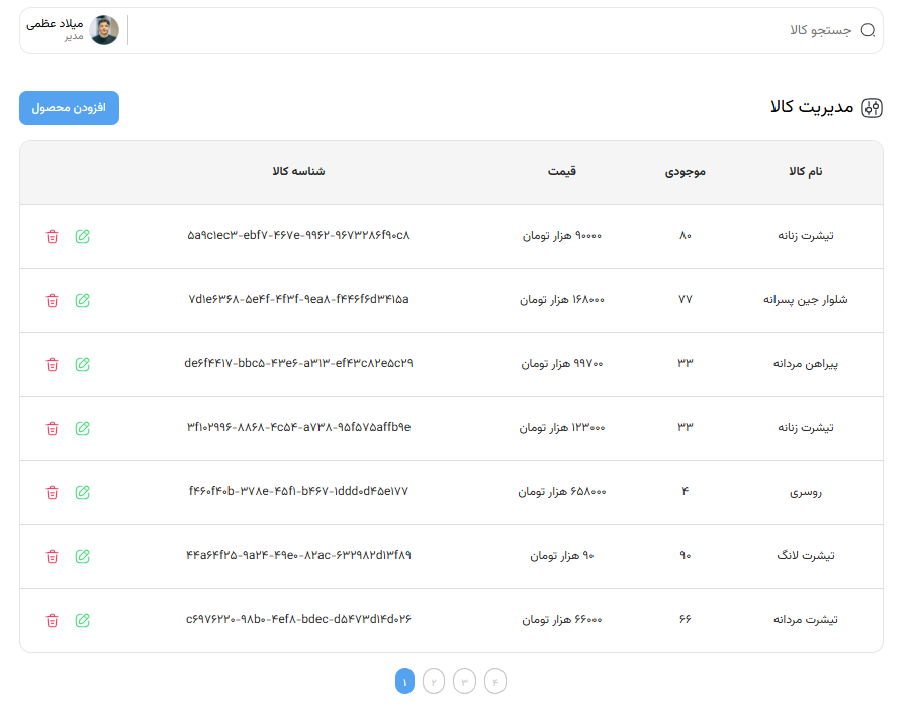
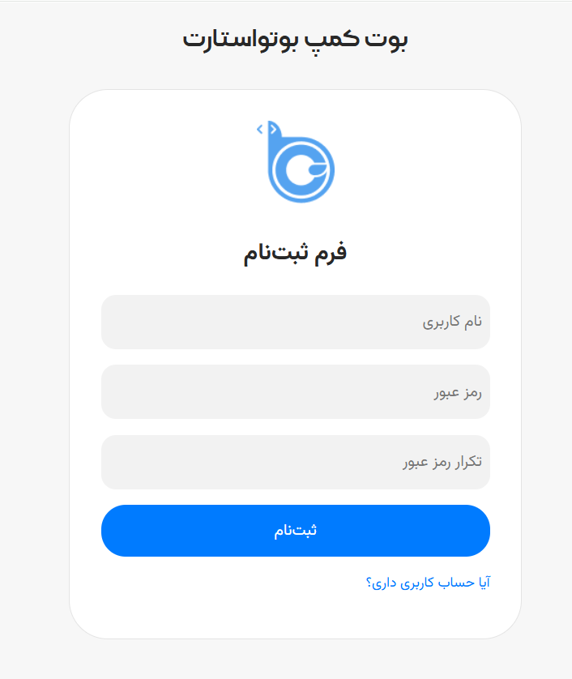

# 🛒 پروژه مدیریت کالا (Product Management)

یک پروژه‌ی مدیریت کالا که با **React + Vite** ساخته شده و به **API واقعی (Swapper)** متصل است.  
در این پروژه امکان **افزودن، ویرایش، حذف، جستجو و صفحه‌بندی (Pagination)** برای کالاها وجود دارد.

---

## 📸 تصاویر پروژه

<p align="center">
  <br/>
  <sub>صفحه مدیریت کالا</sub>
</p>

<p align="center">
  <br/>
  <sub>صفحه ثبت‌نام</sub>
</p>

---

## 🚀 ویژگی‌ها

- ➕ افزودن کالا  
- 📝 ویرایش کالا  
- ❌ حذف کالا  
- 🔍 جستجو در لیست کالاها  
- 📑 صفحه‌بندی (Pagination)  
- 🔐 احراز هویت (ثبت‌نام و ورود کاربر به کمک API)  
- 🎨 طراحی ماژولار با CSS Modules  

---

## 📦 تکنولوژی‌ها

- ⚛️ React (با Vite)  
- 📡 Axios برای ارتباط با API  
- 🔗 Swapper API برای مدیریت داده‌ها  
- 🎨 CSS Modules برای استایل‌دهی  

---

## 📝 توضیح کوتاه

در این پروژه، کاربران می‌توانند:
- لیست کالاها را مشاهده کنند.  
- کالاهای جدید اضافه کنند.  
- موجودی و قیمت کالاها را ویرایش کنند.  
- کالاها را حذف کنند.  
- با استفاده از سرچ، کالاها را فیلتر کنند.  
- با صفحه‌بندی، بین صفحات مختلف کالاها جابجا شوند.  

---

## 💻 نصب و اجرا

1. پروژه را کلون کنید:  
```bash
git clone https://github.com/Nazari-Fatameh/fatemeh-nazari_week19.git
